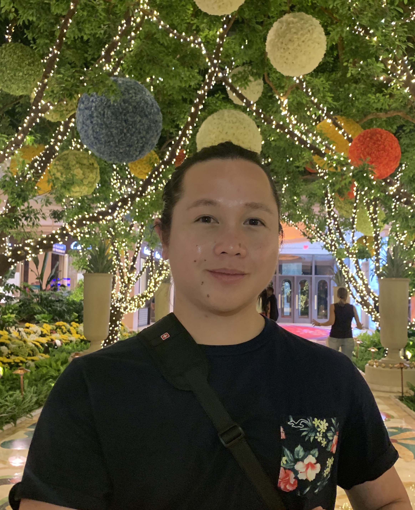

# Irvin Tancioco

I am a student at the University of California, Berkeley majoring in Electrical Engineering and Computer Science of class 2022. I am currently taking Optimization Models, Machine Structure, Efficient Algorithm, Machine Learning, Introduction to Robotics and User Interface. I want to explore the application of Machine Learning/ Artificial Intelligence in the field of Robotics, and Virtual Reality (AR/MR).

### Projects

### Education

<b>University of California, Berkeley</b>
<ul>
Electrical Engineering and Computer Science (Class 2022)
</ul>

<b>City College of San Francisco (Class 2020)</b>
<ul>
  A.S. in Mathematics (with Highest Honors); 
  A.S. in Computer Science (with Highest Honors); 
  A.A. in Liberal Studies with emphasis in Science and Mathematics
</ul>

 

### Skills

  
### Coursework
- CS61AB: Structure and Interpretation of Computer Programs and Data Structure
- CS16AB: Designing Information Devices and Systems 
- CS70: Discrete Mathematics and Probability Theory

### Projects

<video src="https://www.youtube.com/watch?v=3LopI4YeC4I" width="400" height="300">youbute
