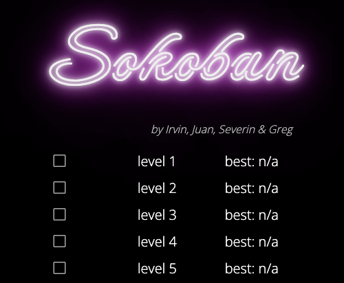
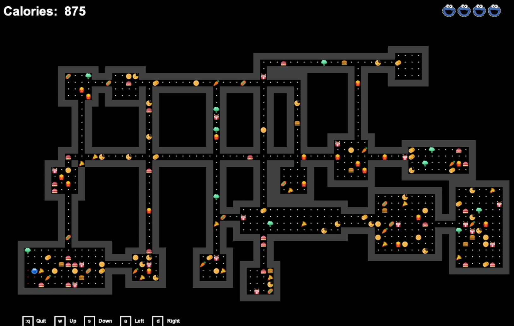
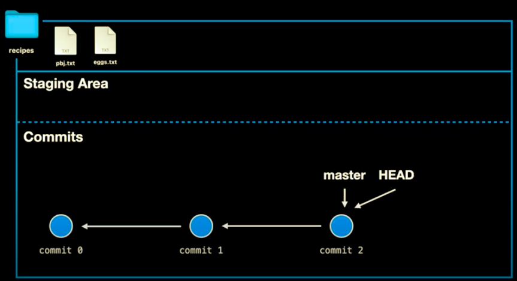
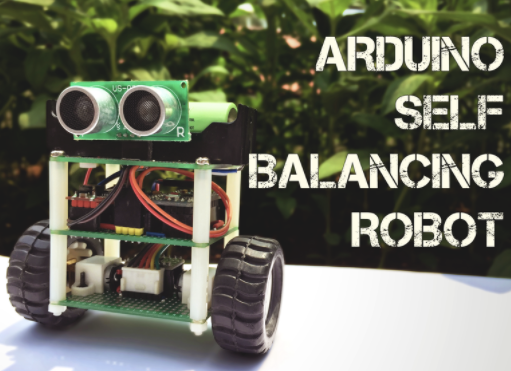
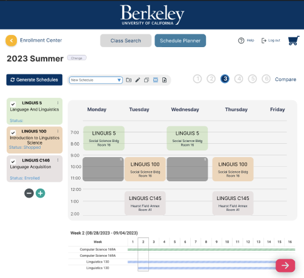
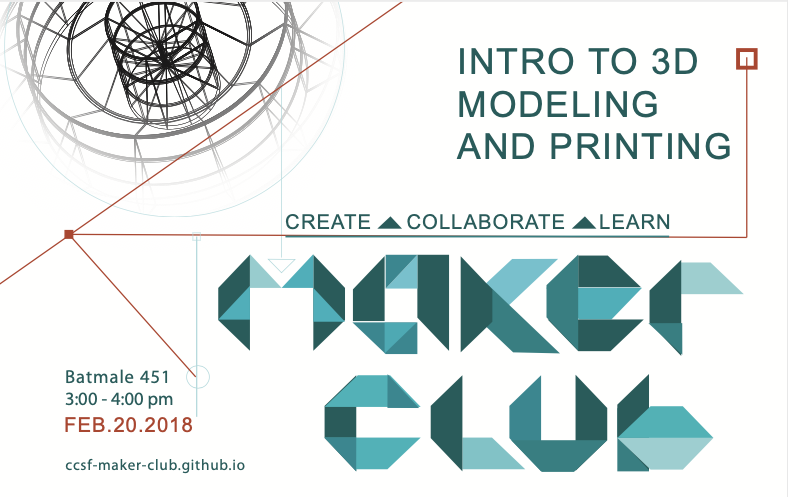
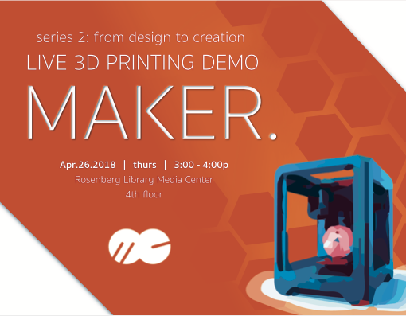

<link type="text/css" rel="stylesheet" href="main.css" />

 
<h2 id="Top"> Electrical Engineering and Computer Science Student</h2>
 

  <a href="Resume10_IrvinTancioco-1.pdf" target="_blank">
    <button class="glow-on-hover glow" type="button">Resume</button>
  </a>
 
  <a href="https://www.linkedin.com/in/irvintancioco/" target="_blank">
    <button class="glow-on-hover glow" type="button">Linkedin</button>
  </a>
  
  <a href="" class="regular">
    
<button class="glow-on-hover glow" type="button">Contact</button>

    
itancio@berkeley[dot]edu

  </a>
  

 
 

I am an EECS student at the Universtiy of California, Berkeley (Class 2023). I am interested in designing experiences using technology. 
<strong> Experience: </strong>
Tax Preparer: Self-Employed (5+ years). 
 Lead Teacher Aide: City College of San Francisco (8 months).
<strong>Education: </strong>
University of California, Berkeley: (EECS, Class 2023).
City College of San Francisco: Associates Degree in Computer Science and Mathematics.
<strong> Volunteer: </strong>
Webmaster / Web Designer.
 <strong>Interests: </strong>
 I am an enthusiast of yoga, dance, food, art, fashion, travel and technology.

 

<!-- Coursework-->
<h2 id="Coursework"> Coursework </h2>
<ul>
 <li><u>DESINV 25: UX Design</u>
 </li>
 
 <li><u>CS188: Artificial Intelligence</u>
 </li>
 
 <li><u>CS161: Computer Security</u>
 </li>
 
 <li><u>CS170: Algorithms and Intractable Problems</u>
 </li>
 
 <li><u>DESINV 15: Design Methodology</u>
 </li>

 <li><u>CS195: Software Development practicum:</u>  The class fosters a collaborative project applying the different aspects of software development.
 </li>
 
 <li><u>EE120: Signals and Systems</u>
 </li>
  
 <li><u>EECS127: Optimization models in Engineering:</u> This is an introduction to optimization models and their applications in machine learning, linear programming and duality.
 </li>
  
 <li><u>CS61ABC: Structure and Interpretation of Computer Programs, Data Structure and Machine Architecture:</u>  Abstraction, Handling Complexity and Data Structures. The class aims to expose students to problem solving techniques in improving the efficiency and handling complexity of computer programs. The class focuses in understanding machine architecture and assembly. The class also teaches the basics of computer languages (python, java, C) to demonstrate understanding of the class's core learning objectives.
  </li>
 
  <li><u>CS16AB: Designing Information Devices and Systems:</u>  Linear Algebra, Gram-Schmidt, Eigenvalues, Least Squares, SVD (Single Value Decomposition), PCA (Principal Component Analysis). The objective of the class is to introduce students to the basics of linear algebra and how this foundational mathematics drive the basic concept of modeling and optimization in machine learning.
  </li>
 
  <li><u>CS70: Discrete Mathematics and Probability Theory:</u>  Proofs, Counting, Probability, Discrete and Continuous Distributions, Markov Chain
  </li>
 
  <li><u>Engineering Lab:</u>  Reading schematics, debugging circuits, and using multimeter, soldering and building simple circuitry.
  </li>
</ul>

 

<!-- Tools -->
<h2 id="Tools"> Tools </h2>

 
 

<!-- Programming Section -->
<h2 id="Code"> Code </h2>
 

  
 
    <h4> Sokoban</h4>
    

       
 Programming Language: C++ 

    

    
Project Description: This is a c++ version of the classic Sokoban game. I worked on the backend implementation of the game and wrote unit tests. One of the function <code>move(x, y)</code> uses a breadth first search that moves the player to a valid destination optimally.
    <a href="https://github.com/itancio/cs195-project" target="_blank"> github link </a>
    <a href="https://itancio.github.io/sokoban/" target="_blank">  |   play game </a>
   

  

  
  

    <h4> Cookie Monster </h4>
    

       
 Programming Language: Java 

    

    
Project Description: This is a game that generates a 2D world and player interaction with collectible items. I worked specifically on graphical user interface (GUI) using stddraw methods. For example, when user hovers to an element on the board, a description of that element will appear at the bottom right of the screen.
      <a href="https://github.com/itancio/cookiemonster" target="_blank"> github link </a> 
      <a href="https://www.youtube.com/watch?v=ES2n5Quh2KE" target="_blank">  |   demo video </a>
    

  

 
   
 
    <h4> Gitlet </h4>
    

       
 Programming Language: Java 

    

    
Project Description: A short program that mimics the functionality of git's version control. I implemented commands needed to initialize, to add, to commit, to remove, to view log and status, to checkout, to branch, and to merge files.
    <a href="https://github.com/itancio/gitlet" target="_blank"> github link </a>
    

  

  
 
    <h4> Ants vs. Some Bees </h4>
    

       
 Programming Language: Python 

    

    
Project Description: The goal of the game is to protect the queen ant from the invasion of the bees. I am responsible for completing the missing methods for different kinds of ants.
    <a href="https://github.com/itancio/ants" target="_blank"> github link </a>
   

  

 
  
 
    <h4> Werewolf </h4>
    

       
 Programming Language: C++ 

    

    
Project Description: The game involves a player and werewolf with a random-generated world. The player can collect items to defend and to escape werewolf. I am responsible for completing the functions for file persistence, interactivity of the player, werewolf, teleportation functionality of the werewolf.
    <a href="https://github.com/itancio/werewolf" target="_blank"> github link </a>
    

 

 

 
<!-- Blog Projects -->
<h2 id="Make"> Make </h2>
 

  
 
    <h4> Sixt33n </h4>
    

    Project Description: This is a voice controlled car project for 16B class at UC Berkeley.
    <a href="" target="_blank"> coming soon </a>
    

          
  

  
 
    <h4> Balancing Robot </h4>
    

    Project Description: (Based on <a href="https://www.instructables.com/Arduino-Self-Balancing-Robot-1/" target="_blank">midhun_s</a> self-balancing robot). This bi-wheeled robot resembles an inverted pendulum with self correcting stability measurements. The motivation for this project is to get experience with building system from schematics and to learn how the feedback loop model makes motor adjustments from the input measurements of the accelerator-gyroscope module.
    <a href="https://github.com/itancio/balance" target="_blank"> github link </a>
    

  

  

 

<!-- Project Graphics -->
<h2 id="Design"> Design </h2>
 

 
  <h4> Cal-Central Redesign </h4>
  

  Project Description: This is a user experience design mock up for UC Berkeley's student portal, CalCentral. We identify some of the design flaws and apply the Gestalt's principle in design (similarity, proximity, continuity) and user-experience design principles (consistency, hierarchy, user control and freedom)
  <a href="https://www.behance.net/gallery/167009587/CalCentral-Redesign" target="_blank"> behance link</a>
  

 
  <h4> Eco-text </h4>
  

  Project Description: The primary goal of the project is to respond to the devastating impact of fast fashion industries in producing textile waste, such as microplastics from synthetic fibers. The objective of this project is to utilize the design methodology: understanding and empathizing with the user; defining a problem statement; ideating ideas through abstract laddering, creative matrix; prototyping product and user testing. 
  <a href="https://eco-tex.weebly.com/" target="_blank"> Eco-tex link </a>
  

  

  

  

  

  

