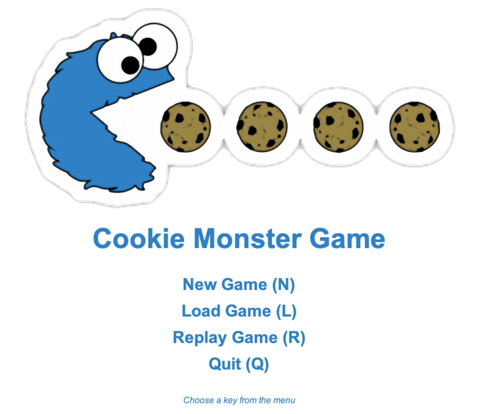
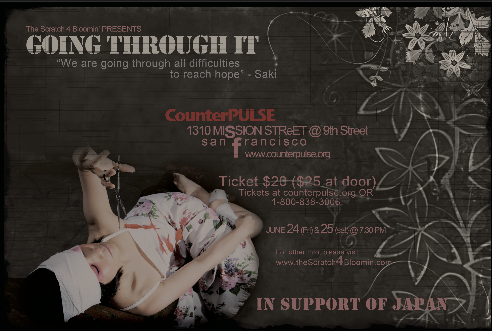

<link type="text/css" rel="stylesheet" href="main.css" />

# Irvin Tancioco

I am a student at the University of California, Berkeley majoring in Electrical Engineering and Computer Science of class 2022. I am currently taking Optimization Models, Machine Structure, Efficient Algorithm, Machine Learning, Introduction to Robotics and User Interface. I want to explore the application of Machine Learning/ Artificial Intelligence in the field of Robotics, and Virtual Reality (AR/MR).

<a href="https://github.com/itancio/resume/blob/64a1b69bacad01ee10c502a76cd7579dc3f75f9e/Resume8_IrvinTancioco-2.pdf" download>View Resume</a>

 
 

### Summary
  <bold> Experience </bold>
  
 Tax Preparer. Self-Employed. Jan 2015 - Present 

  
 Lead Teacher Aide. City College of San Francisco. Aug 2017 - Dec 2017 

  <bold> Education </bold>
  
 University of California, Berkeley. EECS. Class 2022 

  
 City College of San Francisco. Associates. Graduated Spring 2020 

  <bold> Volunteer </bold>
  
 Webmaster / Web Designer. Aug 2013 - Dec 2018 

  

### Skills

<ul>
<b>University of California, Berkeley (Class 2022)</b>
Electrical Engineering and Computer Science
</ul>

<b>City College of San Francisco (Class 2020)</b>
<ul>
  A.S. in Mathematics (with Highest Honors); 
  A.S. in Computer Science (with Highest Honors); 
  A.A. in Liberal Studies with emphasis in Science and Mathematics
</ul>

 

### Coursework

- CS61AB: Structure and Interpretation of Computer Programs and Data Structure
- CS16AB: Designing Information Devices and Systems 
- CS70: Discrete Mathematics and Probability Theory

### Projects

  <h4> Cookie Monster </h4>
  

  Project Description: This is a game that generates a 2D world and player interaction with collectible items. I worked specifically on keyboard and mouse input interaction. When user hovers to an element on the board, a text shows displaying description of that element.
    <a href="https://github.com/itancio/cookiemonster"> github link </a> 
    <a href="https://www.youtube.com/watch?v=ES2n5Quh2KE">  |   demo video </a>
  

   

<!-- Project Gallery Secion -->

  
 
    <h4> Ants vs. Some Bees </h4>
    

    Project Description: (photo credit: Jessica Wan)
    <a href="https://github.com/itancio/ants"> github link </a>
    

     
  

  
 Scheme
    
Project Description:  
    <a href="https://github.com/itancio/schemes"> github link </a>
    

  

  
 Cats
    

    <a href="https://github.com/itancio/cats"> github link </a>
    

  

  
 Hog
    
Project Description:
    <a href="https://github.com/itancio/hog"> github link </a>
    

  

  
 Conway
    
Project Description: 
    <a href="https://github.com/itancio/conway"> github link </a>
    

  

  
 Battleship
    
Project Description: 
    <a href="https://github.com/itancio/battleship"> github link </a>
    

  

  
 Werewolf
    

    <a href="https://github.com/itancio/werewolf"> github link </a>
    

  

<!-- Project Robotic -->

 Sixt33n

 

 Balancing Robot

 

 Logo Designs

 

 Peninsula Ballet Ads (Peter Pan, Nutcracker)

 

### Graphic Works
<!-- Project Graphics -->

  

  

  

  

  

